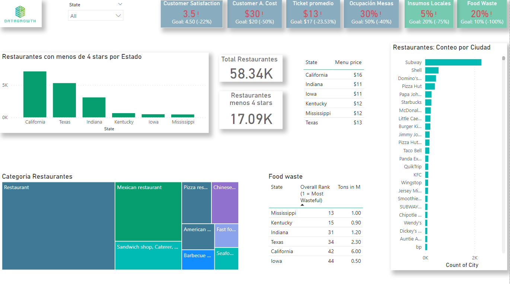

# Análisis para Restaurantes: Insights y Oportunidades

El propósito subyacente de este informe es presentar conclusiones derivadas del análisis de datos del sector gastronómico, proporcionando recomendaciones robustas para empresarios interesados en descubrir espacios de oportunidad y áreas de mejora. Hemos diseñado un Dashboard en PowerBI que facilita la navegación y el filtrado de datos, permitiendo a los usuarios obtener información valiosa de manera intuitiva.

## Dashboard (1/2)

  *Se recomienda hacer lectura en Z.*

La primera sección del dashboard ilustra la distribución geográfica de seis estados estratégicamente seleccionados, basados en un sistema de scoring que incorpora variables como GDP, población, ingresos personales, fast-food per cápita, promedio de renta, impuestos y salario mínimo. La interactividad del mapa permite explorar el PIB y la población de cada estado, resaltando el potencial de Texas y California, seguidos de Kentucky, Indiana, Iowa y Mississippi. La elección de estos estados se fundamenta en su potencial demográfico y económico, junto con la emergente relevancia turística que presentan, impulsada por eventos regionales y prestigiosas instituciones educativas.

Nuestro punto disparador fue entender la estructura de costos de un restaurante promedio. Nos encontramos que el 40% provenia de los insumos/alimentos y el 30% de costos laborales. Es entonces que buscamos aquellos Estados en donde la renta promedio, el salario mínimo, y los impuestos eran más bajos. Aquí encontramos a este subset de Estados, y que además que en los últimos años empezaron a tener un impacto en turismo super relevante. Hay que tener en consideración que estos Estados tienen eventos regionales típicos que atraen a muchos turistas, y que además tienen ciudades universitarias de prestigio que atraen un flujo de gente constante.

## Dashboard (2/2)

Teniendo un entendimiento de contexto, procedemos con lo insights de Google Map reviews y Yelp. Vemos que en estos Estados puntualmente, Google es mucho más popular que Yelp, por lo cual nuestra primera recomendación es invertir en publicidad digital y posicionamiento. Aquí aparece nuestro primer KPI propuesto que tiene que ver con medir y monitorear el costo de adquisición de clientes. Según benchmark de la industria, este se encuentra en 30usd promedio, y proponemos reducirlo a 20usd en 12 meses.

Luego, vemos otro espacio de oportunidad en el área de satisfacción del cliente, ya que de la base de reviews el 30% de los restaurantes tienen menos de 4 estrellas. Nuestro KPI de customer satisfaction propone pasar de 3.5 a 4 puntos en 12 meses.

Por otro lado, nos parecía también relevante entender los precios de menu promedio. Aquí se pueden trabajar estrategias de marketing para hacer upselling y cross-selling, agrandar el combo, ofrecer alimentos saludables como complementos, ofrecer promociones,etc. El KPI que proponemos es aumentar el ticket promedio de 13 a 17usd, y para las nuevas aperturas tener un 30% de ocupacion de mesas en los primeros 6 meses, y 50% luego de 12 meses.

Seguido tenemos un grafico de barras mostrando los restaurantes/cadenas con mayor presencia en ciudades, dentro de esos Estados. Vemos que starbucks, mcdonalds son las principales. Por lo cual hay espacio para ir con una propuesta diferente, considerando la gastronomia regional y la gastronomia saludable en tendencia mundial.

En el siguiente gráfico podemos ver, e incluso filtrar por Estado para entender cuales son las categorias de comidas con mayor cantidad de restaurantes. En California podemos observar una mayor diversidad gastrónomica, que tiene su reparo en la diversidad cultural y étnica de su población, y por otro lado tenemos Texas con menos diversidad pero con una clara preferencia por la comida mexicana (tex-mex). 

Los últimos KPIs que proponemos tienen que ver con la responsabilidad con el medio ambiente. La sustentabilidad es una tendencia global en crecimiento, y los restaurantes tienen una oportunidad dorada para liderar en este ámbito. Si bien California hoy se encuentra en una buena posición por sus políticas ecológicas, aún así tienen grandes volumenes de desperdicio de alimentos. El KPI propone reducir el desperdicio un 10% en 12 meses, en un marco en donde en Estados Unidos como totalidad, de los alimentos que produce el 40% son desperdicios. 

El otro KPI tiene que ver con el compromiso de reducir la huella de carbono, para ello se propone que al menos 20% de la compra de insumos/alimentos sean en no mas de 200km. Esto además ayudaría a impulsar las economías locales, y se aprovecharía el potencial de las economías agricolas.

Resumen de KPIs:

* Customer Satisfaction: 3.5/5 raiting (en 6 meses). 4/5 raiting (en 12 meses)
  
* Ocupación Promedio en nuevos restaurantes: 30% (en 6 meses)/ 50% (en 12 meses)
  
* Ticket promedio: USD$20 (+30%) en 12 meses.
  
* Customer Acquisition Cost: 30usd primeros 6 meses, 20usd después de los 6 meses.
  
* Desperdicio de alimentos: 10% en 12 meses.
  
* Huella de carbono: 20% de los insumos deberan adquirirse en no más de 200km (en 12 meses).
